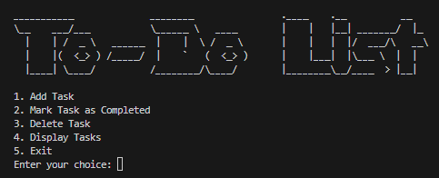

# To-Do App

## A super basic To-Do app made for a first-semester class group project. Uses simple programming concepts learned in class.

## Features

- **Add tasks**: Type in a task and hit enter. Boom, it’s there.
- **Mark tasks as done**: Check them off when you’re done (or pretend to be done).
- **Delete tasks**: Remove tasks you’ll never actually do.

---

## Why This Exists

Had to make something for the group project.

---

## How to Use

1. Download the code.
2. Run it.
3. Add, check, or delete tasks.

---

_Good luck and Pray it works._
